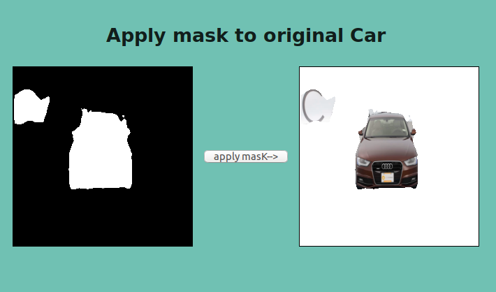

# CAR DRAWING BRUSH TOOL!

Proyecto Final de Master
El objetivo de este proyecto es presentar una herramienta de dibujo que mediente herramientas de deeplearning permita el dibujo de un coche finalizando partido de los trazos a mano alzada de los mismo.

# Preparación del entorno

Pre-requistio:

1.-Cuenta de Kaggle

2.-Opcionalmente puede descargar los modelos ya entrenados y copiarlos en la carpeta /web/backend/modules/app/input_models/

Modelos Entrenados(800MB).-[Modelos Entrenados](https://www.kaggle.com/nopaixx/modelstrain)

3.-Descarga 3 ficheros .zip en la carpeta /downloads/

Fichero1(2GB).-[StandordCars DataSet](https://www.kaggle.com/jutrera/stanford-car-dataset-by-classes-folder)

Fichero2(22GB).-[Carvana cars Image Mask](https://www.kaggle.com/c/carvana-image-masking-challenge)

Fichero3(500MB).-[Intel Image Classification](https://www.kaggle.com/puneet6060/intel-image-classification)

4.-PC >=16Gigas de RAM

5.-PC recomendable con GPU

6.-Tiempo aprox descarga dataset 4 horas

7.-Tiempo aprox train de modelos 24-48 horas

    git clone -b master https://github.com/nopaixx/kschool-tfm.git

 1. Install VirtualEnv `pip install virtualenv`
 2. Create virtual env with enviroments `virtualenv -p python3 venv`
 3. Activate virtualenv `source venv/bin/activate`
 4. Install requirements `pip install -r requirements.txt`
 5. Check python version >3.5 `python --version`
 6. Prepare intel image classification dataset 

`unzip downloads/intel-image-classification.zip -d input/intel-image-classification`

`sudo unzip input/intel-image-classification/seg_train.zip -d input/intel-image-classification/seg_train/`

 7. Prepare carvana image masking dataset 

`unzip downloads/carvana-image-masking-challenge.zip -d input/carvana-image-masking-challenge sudo unzip input/carvana-image-masking-challenge/train.zip -d input/carvana-image-masking-challenge/`

`sudo unzip input/carvana-image-masking-challenge/train_masks.zip -d input/carvana-image-masking-challenge/`

 8. Prepare standford cars dataset 

`unzip downloads/stanford-car-dataset-by-classes-folder.zip -d input/stanford-car-dataset-by-classes-folder`

`sudo unzip input/stanford-car-dataset-by-classes-folder/car_data.zip -d input/stanford-car-dataset-by-classes-folder/car_data`

## Descripción de ficheros

 - **Carvana car Image Mask**.- Este dataset contiene imagenes de coches con su mascara. Este dataset se usa para entrenar un modelo previo para extraer la mascara del coche del fondo de la imagen con el objetivo de mejorar el algoritmo de Canny Edge detection
 - **Intel image classification**.- Contiene imagenes de fondos (ciudades, paisajes etc...) este dataset se usa para mejorar la augmentación de datos del primer Carvana car Image Mask
 - **StandFord cars dataset**.- Este dataset contiene mas de 15 mil imagenes de coches, este datesaet es usado en el último modelo para regenear los coches a partir de los trazos

## Modelo 1 .- Extraer Mascara del coche
El ojetivo de este modelo es usar el Dataset de Carvana Image con el objetivo de entrenar una red neuronal capaz de extraer la mascara de un coche. Una vez obtenida esta mascara la aplicaremos al dataset StandFordCard para aplicar al coche (y solo al coche) el algoritmo de canny edgedetection que conformara el input para la siguiente red neuronal capaz de generar (o regenerar) un coche en funcion de sus trazos.

Problematicas detectadas y puntos fuertes:

El dataset de carvana, a pesar de tener aproximadamente 4000 imagenes de train esto es solo 400 coches únicos ya que los coches se repiten desde diferente angulo y siempre con el mismo fondo, esto es son solo  4000 images incluida la augmentación de datos.

Estos dos echos juntos (mismo fondo y pocos modelos de coches) en las primeras versiones hizo que el modelo una vez entrenado y aplicado en cualquier coche fuera del dataset de carvana (como Standford cars) produciendo resultados muy malos.

La inovación en este punto llego cuando se incorpora una augmentación custom, donde se incorpora el dataset Intel Image Classification, gracias a la gran variedad de fondos disponibles en este dataset y aplicand técnicas de extracción de maskara y interpolación de una imagen encima de otra se consiguio mejorar mucho el model.

Pasos Para la augmentacion:

 1. Extracción de un coche mediante su mascara
 2. Fusionar un coche dentro de un fondo aleatorio

 

## Model 2.- Canny Edge + Car generator Model

En este punto, el objetivo es el siguiente:

 1. Usar el Model 1 y extraer el coche
 2. Aplicar algoritmo de canny edge detection para extraer los trazos del coche
 3. Entrenar un modelo capaz de regenerar el coche a su original partiendo como parametro de entrada los trazo del coche

Arquitecturas trabajadas en modo exploración

 1. Cycle GAN 

Codigo Original.-[Cycle GAN](https://github.com/eriklindernoren/Keras-GAN/tree/master/cyclegan)

 2. PixToPix

Codigo Original.-[PixToPix](https://github.com/eriklindernoren/Keras-GAN/tree/master/pix2pix)

 3. DiscoGAN

Codigo Original.-[DiscoGAN](https://github.com/eriklindernoren/Keras-GAN/tree/master/discogan)

 4. Unet

Codigo en mi git.-[Unet](https://github.com/nopaixx/ComputerVision-Experiments)

 5. Unet + Custom improvement, Dos Unet (edge+avg color car) Join

Este es el modelo presentado en el frontend

## Train Models y probar el frontend-backend Flask (Dockers)

 1. Entrenar el primer modelo

`cd train_model/`

`python first_model.py`

 2. Entrenar el segundo modelo

`cd train_model/`

`python second_model.py`

 3. Copia el contenido de /output/ dentro de web/backend/modules/app/input_models/

 4. Levantar el docker backend
  
`cd web/backend/modules/`

`sudo ./run`

 5. Levantar el docker del frontend

`cd web/frontend/`

`sudo ./buildfrontend`

`sudo ./run`

ENJOY UPLOADING YOUR CARS!

